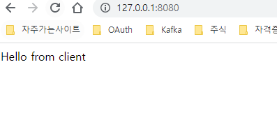
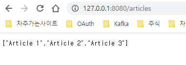
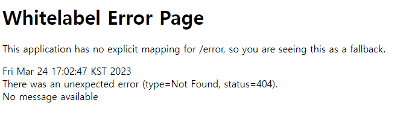

# spring-security-oauth

### 1. host 파일 변경
- 로컬에서 테스트를 위해 host 파일에 아래와 같이 추가한다.
- 127.0.0.1 auth-server
- 호스트파일 위치는 아래와 같다.
  - mac: /etc/hosts
  - window: C:\Windows\System32\drivers\etc\hosts

### 2. auth-server 실행

### 3. resource-server 실행

### 4. client 실행

### 5. client 실행 후 아래 url로 접속
- http://127.0.0.1:8080 또는 - http://127.0.0.1:8080/articles
- 로그인 페이지가 나오면 아래와 같이 입력
  - username: admin
  - password: admin
  - 로그인 후 아래와 같은 화면이 나오면 성공
    -  
    - 
  - 아래와 같은 화면이 나오면 실패
    - 

##### Ref) https://www.baeldung.com/spring-security-oauth-auth-server